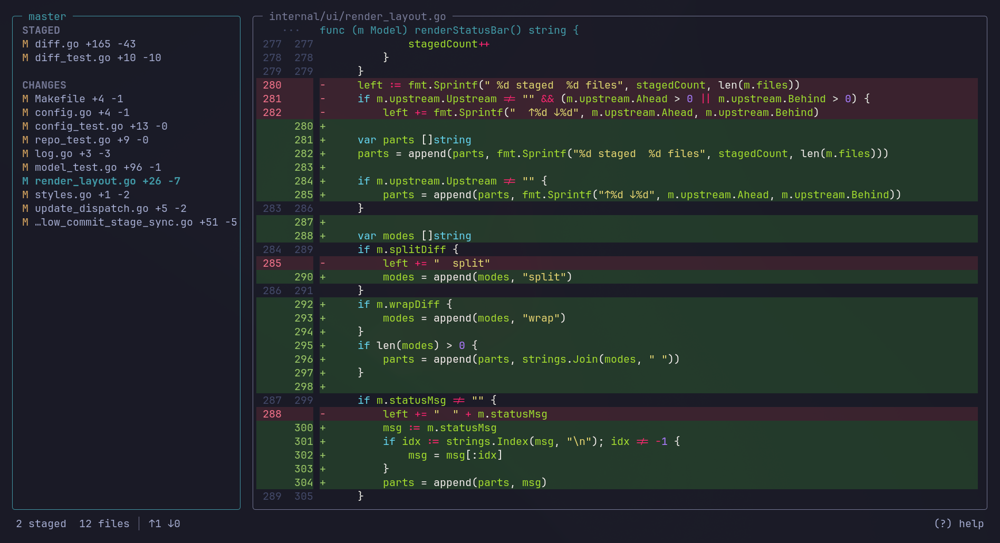

# differ

A modern, lightweight terminal git diff viewer and commit tool. Two-panel layout, syntax highlighting, and 100% keyboard-driven.

<p align="center">
  
</p>

## Install

```bash
brew install dpuwork/tap/differ
```

Or via [mise](https://mise.jdx.dev/):

```bash
mise use -g github:dpuwork/differ
```

Or via Go:

```bash
go install github.com/dpuwork/differ@latest
```

Or build from source:

```bash
make build    # → bin/differ
make install  # → $GOPATH/bin/differ
```

## Usage

```bash
differ            # all changes (staged + unstaged + untracked)
differ -s         # staged only
differ -r main    # compare against ref (branch/tag/commit)
differ -c         # open in review mode, then commit
differ log        # browse recent commits
differ commit     # review staged changes and commit
```

## Keyboard Shortcuts

### File List

| Key           | Action                                     |
| ------------- | ------------------------------------------ |
| `j/k`         | navigate files                             |
| `enter` / `l` | view diff                                  |
| `tab`         | stage/unstage file                         |
| `x`           | discard unstaged changes                   |
| `a`           | stage all changes                          |
| `c`           | commit staged changes                      |
| `b`           | open branch picker                         |
| `s`           | toggle split (side-by-side) diff           |
| `w`           | toggle text wrap                           |
| `e`           | open in editor (`$EDITOR`) & quit          |
| `P`           | push to upstream                           |
| `F`           | pull from upstream                         |
| `g/G`         | first/last file                            |
| `q`           | quit                                       |
| `?`           | help popup                                 |

### Diff View

| Key         | Action             |
| ----------- | ------------------ |
| `j/k`       | scroll diff        |
| `d/u`       | half page down/up  |
| `g/G`       | top/bottom         |
| `n/p`       | next/prev file     |
| `tab`       | stage/unstage      |
| `x`         | discard unstaged   |
| `b`         | open branch picker |
| `s`         | toggle split diff  |
| `w`         | toggle text wrap   |
| `e`         | open in editor     |
| `esc` / `h` | back to file list  |

### Commit Mode

| Key     | Action         |
| ------- | -------------- |
| `enter` | confirm commit |
| `esc`   | cancel         |

### Branch Picker

| Key             | Action               |
| --------------- | -------------------- |
| type            | filter branches      |
| `↑/↓` / `^j/^k` | navigate list        |
| `enter`         | switch to branch     |
| `ctrl+n`        | create new branch    |
| `esc`           | clear filter / close |

## Features

- **Syntax highlighting** via Chroma (Go, JS/TS, Rust, Python, etc.)
- **Staged/unstaged/untracked** file tracking
- **Split (side-by-side) diff** view
- **Branch management**: switch and create branches
- **Push/Pull** integration with upstream status (ahead/behind counts)
- **Commit log browser** with diff preview
- **Compare against any ref**: `differ -r <ref>`
- **No dependencies**: single binary, just `git` in your `$PATH`
- **Auto-refresh**: reflects external changes every 2 seconds
